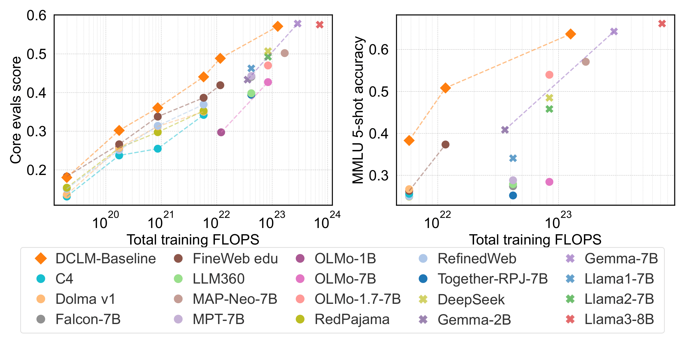
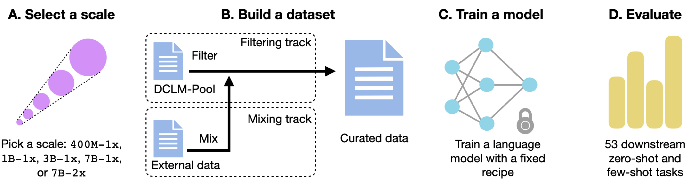

# DataComp-LM (DCLM)

## Table of Contents
- [Introduction](#introduction)
- [Leaderboard](#leaderboard)
- [Getting Started](#getting-started)
- [Workflow Overview (and Exp Data)](#workflow-overview-and-exp-data)
  - [Selecting Raw Sources](#1-selecting-raw-sources)
  - [Processing the Data](#2-processing-the-data)
    - [Ray-based Filtering and Cleaning](#ray-based-filtering-and-cleaning)
    - [Deduplication](#deduplication)
  - [Tokenization and Shuffling](#3-tokenization-and-shuffling)
  - [Model Training](#4-model-training)
  - [Model Evaluation](#5-model-evaluation)
    - [Submission](#submission)
- [Downloading Artifacts](#downloading-artifacts)
  - [Datasets](#datasets)
  - [Pretrained Models](#pretrained-models)
- [Example Commands to Train 1B model with DCLM baseline](#example-commands-to-train-1b-model-with-dclm-baseline)
- [How to Contribute](#how-to-contribute)
- [How to Cite Us](#how-to-cite-us)
- [License](#license)

## Introduction

[DataComp-LM (DCLM)](https://datacomp.ai/dclm/) is a comprehensive framework designed for building and training large language models (LLMs) with diverse datasets. It offers a standardized corpus of over 300T unfiltered tokens from CommonCrawl, effective pretraining recipes based on the open_lm framework, and an extensive suite of over 50 evaluations. This repository provides tools and guidelines for processing raw data, tokenizing, shuffling, training models, and evaluating their performance.

DCLM enables researchers to experiment with various dataset construction strategies across different compute scales, from 411M to 7B parameter models. Our baseline experiments show significant improvements in model performance through optimized dataset design.

Already, DCLM has enabled the creation of several high-quality datasets that perform well across scales and outperform all open datasets.

<p align="center">
  <em><b>Developing datasets for better models that are cheaper to train.</b> Using DataComp-LM, we develop a high-quality dataset, DCLM-BASELINE, which we use to train models with strong compute performance tradeoffs. We compare on both a Core set of tasks (left) and on MMLU 5-shot (right). DCLM-BASELINE (orange) shows favorable performance relative to both closed-source models (crosses) and other open-source datasets and models (circles).</em>
</p>

**Submission workflow**:
* **(A)** A participant chooses a scale, where larger scales reflect more target training tokens and/or model parameters.
The smallest scale is 400m-1x, a 400m parameter model trained compute optimally (1x), and the largest scale is 7B-2x, a 7B parameter model trained with twice the tokens required for compute optimallity.

* **(B)** A participant filters a pool of data (filtering track) or mixes data of their own (bring your own data track) to create a dataset.

* **(C)** Using the curated dataset, a participant trains a language model, with standardized training code and scale-specific hyperparameters, which is then

* **(D)** evaluated on 53 downstream tasks to judge dataset quality.


For more details, please refer to our [paper](https://arxiv.org/abs/2406.11794).

## Leaderboard

The DCLM [leaderboard](https://datacomp.ai/dclm/leaderboard) showcases the performance of models trained on various scales and datasets. The leaderboard is updated regularly with the latest submissions from the community.

Below are comparisions of our model with others in the 7B regime.

| Model         | Params | Tokens | Open dataset? | CORE     | MMLU     | EXTENDED |
|---------------|--------|--------|---------------|----------|----------|----------|
| **Open weights, closed datasets** |        |        |               |          |          |          |
| Llama2        | 7B     | 2T     | ✗             | 49.2     | 45.8     | 34.1     |
| DeepSeek      | 7B     | 2T     | ✗             | 50.7     | 48.5     | 35.3     |
| Mistral-0.3   | 7B     | ?      | ✗             | 57.0     | 62.7     | 45.1     |
| QWEN-2        | 7B     | ?      | ✗             | 57.5     | **71.9** | 50.5     |
| Llama3        | 8B     | 15T    | ✗             | 57.6     | 66.2     | 46.3     |
| Gemma         | 8B     | 6T     | ✗             | 57.8     | 64.3     | 44.6     |
| Phi-3         | 7B     | ?      | ✗             | **61.0** | 69.9     | **57.9** |
| **Open weights, open datasets** |        |        |               |          |          |          |
| Falcon        | 7B     | 1T     | ✓             | 44.1     | 27.4     | 25.1     |
| OLMo-1.7      | 7B     | 2.1T   | ✓             | 47.0     | 54.0     | 34.2     |
| MAP-Neo       | 7B     | 4.5T   | ✓             | **50.2** | **57.1** | **40.4** |
| **Models we trained** |        |        |               |          |          |          |
| FineWeb edu   | 7B     | 0.14T  | ✓             | 38.7     | 26.3     | 22.1     |
| FineWeb edu   | 7B     | 0.28T  | ✓             | 41.9     | 37.3     | 24.5     |
| **DCLM-BASELINE** | 7B     | 0.14T  | ✓             | 44.1     | 38.3     | 25.0     |
| **DCLM-BASELINE** | 7B     | 0.28T  | ✓             | 48.9     | 50.8     | 31.8     |
| **DCLM-BASELINE** | 7B     | 2.6T   | ✓             | **57.1** | **63.7** | **45.4** |


## Getting Started
To get started with DCLM, follow these steps:

1. **Clone the repository**:
    ```bash
    git clone https://github.com/mlfoundations/DCLM.git
    cd DCLM
    ```

2. **Install dependencies**:
    ```bash
    pip install -r requirements.txt
    ```
    Before installing the dependencies, make sure cmake, build-essential, and g++ are installed, e.g., by installing:
    ```bash
    apt install cmake build-essential
    apt install g++-9
    update-alternatives --install /usr/bin/g++ g++ /usr/bin/g++-9 90
    ```
    To download additional models and data needed for baseline reproduction, run:
    ```bash
    python setup.py install
    ```

3. **Set up your environment**:
    DCLM uses AWS for storage and possible as a compute backend, and ray for distributed processing.
    Ensure you have the necessary environment variables and configurations for AWS and Ray clusters.

    We recommend the use of Python 3.10 with DCLM.

## Workflow Overview and Exp Data

At a high-level, the DCLM workflow consists of five main steps: (1) raw source selection; (2) data processing; (3) tokenization and shuffling; (4) model training; (5) model evaluation. To be eligible for our leaderboards, you are required to use our scripts for steps (3)-(5). For data processing, you are welcome to use and/or build upon our code, but are also free to perfrom this step with your own implementation.

To help keep track of and run experiments, this repository uses the [exp_data](exp_data) folder to log a record of the inputs and outputs of these steps (e.g., datasets created, models trained, and evaluations finished). Each record is called a "reference JSON" and can be thought of as an ID card for a particular input or output asset. Overall, there are four categories of reference JSONs:

- **Untokenized Datasets:** these refer to datasets in their raw text form which can either be the inputs or outputs of data processing ([exp_data/datasets/raw_sources](exp_data/datasets/raw_sources) and [exp_data/datasets/untokenized](exp_data/datasets/untokenized)).
- **Tokenized Datasets:** these refer to tokenized datasets generated by the tokenize-shuffle, which can be thought of as the step that "compiles" a curated dataset in preparation for traning ([exp_data/datasets/tokenized](exp_data/datasets/tokenized)).
- **Models:** these refer to models generated by the training step ([exp_data/models](exp_data/models))
- **Evaluations:** these store the evaluation results for a specific model ([exp_data/evaluations](exp_data/evaluations)).

For steps after raw source selection, most of our scripts require you to specify the correct input reference JSON(s) and a JSON for the output is generated automatically via Python-based code. By default, generated reference JSONs will also contain relevant pointers to the inputs that resulted in the referenced asset (e.g. a model JSON will contain a pointer to the tokenized dataset that was used to train it). Specifically reference JSONs are used as follows:

  1. **Data processing** and **Tokenize-Shuffle** both take in a relative path to an untokenized dataset JSON to detect where the input dataset is stored. Using our ray-based implementations will generate untokenized and tokenized dataset JSONs respectively.
  2. **Training** takes in a relative path to a tokenized dataset JSON to detect the location of the dataset and its corresponding manifest file. A model JSON will be generated.
  3. **Evaluation** can take the uuid of a model to automatically populate most of the evaluation script's arguments. An evaluation JSON will be generated.

If needed (e.g., when setting up a new raw source or when using your own code for data processing), you can manually create a JSON by copying the format of one of the existing files and modifying the relevant fields.  When doing so, it is key to generate a new uuid (i.e., ``python -c "import uuid; print(uuid.uuid4().__str__())"``) to replace the existing one because that is the unique identifier the code uses to identify each JSON. Paths in the JSON may be local as long as they are accessible when the json is used.

## (1) Selecting Raw Sources

### Filtering Track


We provide multiple standardized input pools that serve as starting points for participants to apply their curation strategies. These datasets vary along two key dimensions:
- Compute scale: 400M-1x, 1B-1x, 3B-1x, 7B-1x, 7B-2x
- Amount of pre-processing: either DCLM-Pool or DCLM-RefinedWeb

To decide upon compute scale, participants should consider their available resources and refer to the training costs in the Model Training section. As for pre-processing, our main set of competition pools are subsets of DCLM-Pool, consisting of unfiltered Common Crawl data that has only undergone text extraction (via ``resiliparse``). Meanwhile, we also provide standardized subsets of DCLM-RefinedWeb, which applies all processing steps from DCLM-Baseline to DCLM-Pool with the exception of our OH2.5 + ELI5 ``fastText`` filter. This set of pools can be used by participants who wish to more conveniently test a curation strategy as a drop-in replacement for our ``fastText`` classifier (without needing to repeat the earlier parts of our DCLM-Baseline pipeline).

Note that as of now, the DCLM-RefinedWeb pools do not match up exactly to being procesed versions of the DCLM-Pool competition pools. Hence, we do not combine their resulting submissions into the same leaderboard. For more details about downloading a specific input pool, please see the [Downloading Artifacts](#downloading-artifacts) section.

After downloading the appropriate starting pool, you will need to create a reference JSON for it *if you wish to use/build upon our processing code.* Most importantly, this JSON should contain the URL to the where your copy of the input pool exists.

### Mixing Track

For the mixing track, participants are welcome to create and register a new source (e.g., Wikipedia, GitHub, etc.). In this case, they should follow the below steps:

- Ensure your data is stored in JSONL format, ideally compressed with zstandard (though uncompressed or gzip-compressed files will also work), where each line corresponds to a single page/document.
- Key names in these JSONL should be consistent with those in [here](baselines/core/constants.py). Most importantly, there should be a ``"text"`` key for each line that contains the actual content of the page.
- Create a reference JSON in [exp_data/datasets/raw_sources](exp_data/datasets/raw_sources). These act as the ID card for the source, and include key information such as the source of the content, its size and most importantly, where is it stored.


## (2) Processing the Data

Given a desired raw dataset, this is the key step in which you as a participant apply your own custom data curation strategies. To get started, you can (but are NOT required to) use and build upon our data processing scripts which include various filtering and deduplication operations implemented in our codebase. Specifically, these operations fall into two groups.

### Ray-based filtering and cleaning

Our codebase incudes a `ray`-based data processing engine that is best suited for highly-parallelized application of "local operations" that independently operate on each page (e.g., filtering). The entrypoint for this engine is `ray_processing/process.py` and using it involves the following steps.

1. **Define a set of processing steps**:
    Create a pipeline config YAML file specifying the operations.
    See our [reproduction of C4 for example](baselines/baselines_configs/c4.yaml).
    Further details on defining a pipeline can be found [here](baselines/README.md).

2. **Set up a Ray cluster**:
    The data processing script relies on Ray for distributed processing of data. This cluster can be either launched on a single node (for small scale data processing) or using AWS EC2 instances.
    There is also work to [deploy Ray on slurm setups](https://docs.ray.io/en/latest/cluster/vms/user-guides/community/slurm.html), though this effort is still a work-in-progres.

    To launch a local cluster, use the following command:
    ```bash
    ray start --head --port 6379
    ```

    To launch a cluster using AWS EC2 instances, use the following:
    ```bash
    ray up <your_cluster_config>
    ```
    where ```<your_cluster_config>``` is a cluster configuration script that depends on your specific use case. We invite the reader to go over the [Ray documentation](https://docs.ray.io/en/latest/cluster/vms/references/ray-cluster-cli.html) for details on how to create this config file.

    **Important**: When using EC2 instances, make sure to tear down your cluster with ``ray down <your_cluster_config>`` after your job finishes, so as not to incur unnecessary costs!

    A sample config file can be seen here (make sure to adapt to your needs):

    ```yaml
    cluster_name: test-processing
    max_workers: 2
    upscaling_speed: 1.0
    available_node_types:
        ray.head.default:
            resources: {}
            node_config:
                ImageId: ami-0c5cce1d70efb41f5
                InstanceType: i4i.4xlarge
                IamInstanceProfile:
                    # Replace 000000000000 with your IAM account 12-digit ID
                    Arn: arn:aws:iam::000000000000:instance-profile/ray-autoscaler-v1
        ray.worker.default:
            min_workers: 2
            max_workers: 2
            node_config:
                ImageId: ami-0c5cce1d70efb41f5
                InstanceType: i4i.4xlarge
                IamInstanceProfile:
                    # Replace 000000000000 with your IAM account 12-digit ID
                    Arn: arn:aws:iam::000000000000:instance-profile/ray-autoscaler-v1

    # Cloud-provider specific configuration.
    provider:
        type: aws
        region: us-west-2
        cache_stopped_nodes: False

    setup_commands:
        - sudo mkfs -t xfs /dev/nvme1n1
        - sudo mount /dev/nvme1n1 /tmp
        - sudo chown -R $USER /tmp
        - sudo chmod -R 777 /tmp
        - wget https://repo.anaconda.com/miniconda/Miniconda3-py310_23.3.1-0-Linux-x86_64.sh -O miniconda.sh
        - bash ~/miniconda.sh -f -b -p /tmp/miniconda3/
        - echo 'export PATH="/tmp/miniconda3/bin/:$PATH"' >> ~/.bashrc
        # Include your AWS CREDS here
        - echo 'export AWS_ACCESS_KEY_ID=' >> ~/.bashrc
        - echo 'export AWS_SECRET_ACCESS_KEY=' >> ~/.bashrc
        - pip install --upgrade pip setuptools wheel
        - pip install -U "ray[default] @ https://s3-us-west-2.amazonaws.com/ray-wheels/latest/ray-3.0.0.dev0-cp310-cp310-manylinux2014_x86_64.whl"
        - pip install boto3==1.26.90
        - pip install s3fs==2022.11.0
        - pip install psutil
        - pip install pysimdjson
        - pip install pyarrow
        - git clone https://github.com/mlfoundations/dclm.git
        - pip install -r dclm/requirements.txt
        - cd dclm && python3 setup.py install
    ```

3. **Run the processing script**:
    To run the processing script, in the case of a local cluster, simply run the following command:
    ```bash
    python3 ray_processing/process.py --source_ref_paths <source_json> --readable_name <name> --output_dir <s3_output_dir> --config_path <config_yaml> --source_name <source_name>
    ```

    When using EC2 instances, you need to connect to the cluster and then launch the command
    ```bash
    # In your local terminal
    ray attach <your_cluster_config>

    # Inside the cluster EC2 instance
    cd dclm
    export PYTHONPATH=$(pwd)
    python3 ray_processing/process.py --source_ref_paths <source_json> --readable_name <name> --output_dir <s3_output_dir> --config_path <config_yaml> --source_name <source_name>
    ```

5. **Monitor and tear down**:
   You can track the progress of data processing via the `global_stats.jsonl` file in the output directory. If run successfully, a new untokenized dataset json should have been created in `exp_data/datasets/untokenized/` that you should commit and push if you wish to save it. After the job finishes,  you can tear down your cluster via `ray stop` (in the local cluster case) or `ray down <your_cluster_config>` (in the AWS EC2 case). **THIS IS VERY IMPORTANT TO NOT INCUR ADDITIONAL COSTS WHEN USING EC2!**

### Deduplication

Our most efficient (and recommended) deduplication implementations were written in Rust instead of Python.  To deduplicate the raw text as we have done in DCLM-Baseline, we use the rust tools provided in the [dedup](dedup/) subdirectory, which icludes several programs for inter-document fuzzy deduplication, i.e., identifying near-duplicates across documents in the corpus. In DCLM-Baseline, we specifically use BFF ([dedup/bff](dedup/bff)). Specific instructions to run deduplication are contained in the README in each of the directories containing the rust tools.

Unfortunately, as of now, these rust implementations are not integrable with the ray-based pipelines described above (i.e., cannot be added to the YAML configs). In contrast, we also did create tooling built with ``ray`` to identify exact content and URL duplicates ([ray_processing/dedup_jsonl.py](ray_processing/dedup_jsonl.py)). This can be integrated into ray-based workflows above but we do not use this form of deduplication in DCLM-Baseline.

## (3) Tokenization and Shuffling
Once you have finished all of your data curation, you can now prepare your dataset for evaluation by first tokenizing and shuffling it in preparation for training. We support both a rust-based and ray-based tokenize shuffle, though we recommend the rust based approach for most workflows because it is single machine and is more efficient. The ray-based approach is still useful for datasets that are too large to be processed on a single machine.

### Rust Based

System requirements:
- enough RAM to process num_threads * num_local_cells local cells. Typically this will be much much smaller than the size of the dataset itself.
- enough disk space to hold 2X the entire dataset.

While the code supports reading from and writing to AWS, it is sometimes unreliable and we strongly recommend copying your data from S3 to local using AWS CLI or s5cmd and using local paths.

```bash
curl --proto '=https' --tlsv1.2 -sSf https://sh.rustup.rs > rustup.sh
bash rustup.sh -y
source ~/.bashrc

# from DCLM folder
cd rust_processing/tokshuf-rs
cargo build --release

# if needed, copy dataset from s3 to local

cargo run --release -- \
--input path/to/raw/dataset \
--local-cell-dir tmp/path/to/storage/for/local/cells \
--output path/to/output/location \
--tokenizer "EleutherAI/gpt-neox-20b" \ #other supported option is "meta-llama/Meta-Llama-3-8B"
--seqlen 2049 \
--wds-chunk-size 8192 \
--num-local-cells 512 # 512 is a good compromise, but might need to raise this much higher for really large datasets
```

Example command:
```bash
curl --proto '=https' --tlsv1.2 -sSf https://sh.rustup.rs > rustup.sh
bash rustup.sh -y
source ~/.bashrc

# from DCLM folder
cd rust_processing/tokshuf-rs
cargo build --release

aws s3 cp --recursive s3://commoncrawl/contrib/datacomp/DCLM-baseline/global-shard_03_of_10/local-shard_1_of_10/ dclm_local
mkdir tokshuf_tmp
mkdir dclm_tokshuf

cargo run --release -- \
--input dclm_local \
--local-cell-dir tokshuf_tmp \
--output dclm_tokshuf \
--tokenizer "EleutherAI/gpt-neox-20b" \
--seqlen 2049 \
--wds-chunk-size 8192 \
--num-local-cells 512
```

Since this is rust based code, this will not automatically generate a dataset json in exp_data. You can copy an existing file like exp_data/datasets/tokenized/rw_v2_w_substr_cc_v3_f0.15_resiliparse_try3_100_nodes.json to exp_data/datasets/tokenized/dclm_rust_tok_shuf_test.json, and make sure to change the relevant fields (most important are uuid, name, dataset_url, manifest_url).

### Ray Based
After processing the raw text, you should convert it into tokenized datasets and perform shuffling for training:

1. **Set up a Ray cluster**:
    Set up a Ray cluster in the same way as the processing step.

2. **Run the tokenize and shuffle script**:
    ```bash
    python ray_processing/tokenize_shuffle.py --source_ref_paths <source_jsons> --readable_name <name> --output <s3_output_dir> --content_key text --do_sample --default_dataset_yaml <mixing_yaml>
    ```

3. **Tear down**:
   Tear down the Ray cluster as in the processing step.

The `tokenize_shuffle.py` script creates a dataset in `webdataset` format, along with a `manifest.jsonl` file. This file is required by the training script, and it contains information on the number of sequences inside each shard of the dataset. If needed, this manifest file can also be created manually, via the following command:

```bash
python -m open_lm.utils.make_wds_manifest --data-dir <tokenized_data_dir>
```

## (4) Model Training
To train a model using the tokenized dataset and one of our fixed training recipes:

1. **Run the training script**:
    ```bash
    torchrun --nproc-per-node <num_gpus> -m training.train -- --scale <scale> --data-config <tokenized_json> --logs <log_dir> --attn-name torch_attn [--remote-sync <s3_bucket>] [--report-to-wandb] [--num-checkpoints checkpoints] [--multiple-data-passes] [--acc 4] [--torchcompile]
    ```

    Argument explanations:
    - scale can be found in training/configs (do not include path and .json)
    - data-config is dataset in exp_data: exp_data/datasets/tokenized (include path and .json)
    - logs is where you want local logs to be written
    - attn-name specifies the attention implementation (torch_attn recommended)
    - remote-sync is where the checkpoints are written to on s3
    - report-to-wandb logs to wandb
    - num-checkpoints sets number of checkpoints to save, best effort and may not be actually this number
    - multiple-data-passes enables training on multiple epochs for the dataset; you may need to adjust num-checkpoints if the dataset is too small and does not contain enough files to properly split across gpus/workers/checkpoints
    - acc sets gradient accumulation, which is automatically specified by the scale; however you may want to manually adjust based on resources available
    - torchcompile uses torchcompile to speed up training, and is available for scales that include "fast"

    Example command:
   ```bash
    torchrun --nproc-per-node 8 -m training.train -- --scale 1b_1x_fast --data-config exp_data/datasets/tokenized/rw_v2_w_substr_cc_v3_f0.15_resiliparse_try3_100_nodes.json --logs rw_training_local_logs --attn-name torch_attn --torchcompile
    ```
   Note that this example will not work until you change the dataset_url and manifest_url in exp_data/datasets/tokenized/rw_v2_w_substr_cc_v3_f0.15_resiliparse_try3_100_nodes.json.

You can expect the following training times per track:

| Scale  | Model parameters | Train tokens | Train FLOPs | Train H100 hours | Pool size |
|--------|------------------|--------------|-------------|------------------|-----------|
| 400M-1x| 412M             | 8.2B         | 2.0e19      | 26               | 137B      |
| 1B-1x  | 1.4B             | 28B          | 2.4e20      | 240              | 1.64T     |
| 1B-5x  | 1.4B             | 138B         | 1.2e21      | 1200             | 8.20T     |
| 7B-1x  | 6.9B             | 138B         | 5.7e21      | 3700             | 7.85T     |
| 7B-2x  | 6.9B             | 276B         | 1.1e22      | 7300             | 15.7T     |

2. **Monitor and manage your training jobs**:
    Use slurm sbatch scripts or Sagemaker for running experiments on various compute infrastructures.

## (5) Model Evaluation
Evaluation yamls are found in the "eval" folder and they determine which tasks to evaluate. For example, "eval/mmlu_and_lowvar.yaml" contains the tasks to be able to compute the core metric and MMLU, while "eval/heavy.yaml" runs additional tasks so that aggregate can also be computed.

Evaluate trained models using the following methods:

1. **Preferred Method**:
    This method uses the UUID from the json that is automatically created from training which can be found in exp_data/models.
    ```bash
    python tools/eval_expdb.py --num_gpus <num_gpus> --no_skip --output_dir <output_dir> --eval_yaml "eval/<eval_yaml>" -f "uuid=<model_uuid>" --skip_perplexity
    ```

    Example command:
   If the model we trained saved its json at exp_data/models/rw_original-open_lm_1b-5.0.json, the UUID is c014f9d6-51d0-429d-9a3e-fe82e53c37fd. Note that this will not actually run because the checkpoint_url and params_url are not publicly accessible; but the automatically generated json for your model will have the correct and accessible paths.
   ```bash
    python tools/eval_expdb.py --num_gpus 8 --no_skip --output_dir exp_data/evals/ --eval_yaml "eval/mmlu_and_lowvar.yaml" -f "uuid=c014f9d6-51d0-429d-9a3e-fe82e53c37fd" --skip_perplexity
    ```

2. **Direct Evaluation**:
    This method requires manually specifying the checkpoint path and model params file (both are outputs from training), as well as specifying the model config (training/open_lm_configs).
    ```bash
    torchrun --nproc_per_node <num_gpus> eval/eval_openlm_ckpt.py --checkpoint <checkpoint> --eval-yaml <eval_yaml> --config <model_params_file> --model <open_lm_config> --output-file <output_file_path>
    ```

We also support evaluation on existing huggingface models:
```bash
    torchrun --nproc_per_node 8 eval/eval_openlm_ckpt.py --hf-model allenai/OLMo-1B-0724-hf --tokenizer allenai/OLMo-1B-0724-hf --eval-yaml "eval/mmlu_and_lowvar.yaml" --output-file exp_data/evals/olmo_eval_mmlu_and_lowvar.json --donot-compute-perplexity
```

### Submission
When you finish training and evaluating your model, a model eval JSON file has been generated and is at [exp_data/evals](exp_data/evals).

You can now open a pull request to the main repository to share your results with the team and submit it to the leaderboard.


## Downloading Artifacts

### Datasets

We provide multiple datasets, both as starting points for each of the competition scales, as well as the results of our processing pipeline.

- The dataset pools for the competition stages are available at HuggingFace, with different repositories for the [400m-1x](https://huggingface.co/datasets/mlfoundations/dclm-pool-400m-1x), [1b-1x](https://huggingface.co/datasets/mlfoundations/dclm-pool-1b-1x), [1b-5x](https://huggingface.co/datasets/mlfoundations/dclm-pool-1b-5x), [7b-1x](https://huggingface.co/datasets/mlfoundations/dclm-pool-7b-1x) and [7b-2x](https://huggingface.co/datasets/mlfoundations/dclm-pool-7b-2x) scales. All these pools contain raw data and can be processed with the steps outlined above. All of these are subsets of out entire raw pool, [DCLM-pool](https://data.commoncrawl.org/contrib/datacomp/DCLM-pool/index.html), which is available via the CommonCrawl S3 bucket.

- Our final processed dataset, DCLM-Baseline, is available on Huggingface in both [zstd compressed jsonl](https://huggingface.co/datasets/mlfoundations/dclm-baseline-1.0) and [parquet](https://huggingface.co/datasets/mlfoundations/dclm-baseline-1.0-parquet) formats. The former version is also available on the CommonCrawl S3 bucket, accessed via the instructions [here](https://data.commoncrawl.org/contrib/datacomp/DCLM-baseline/index.html).

- We also provide a version of our dataset that performs all the steps of our preprocessing except the final one (namely, the fasttext filtering). This version, called DCLM-RefinedWeb, is also available on the CommonCrawl S3 bucket, with instructions available [here](https://data.commoncrawl.org/contrib/datacomp/DCLM-refinedweb/index.html). For official competition subsets of DCLM-RefinedWeb, please download the following shards (written in brace notation). Unfortunately, we do not yet have a fixed subset for the 400M-1x scale currently, as the size for this would be smaller than one local shard, the unit we ran deduplication on.

   ```
   # 1B-1x (uses 1 local shard out of the original 100)

   s3://commoncrawl/contrib/datacomp/DCLM-refinedweb/global-shard_03_of_10/local-shard_1_of_10/

   # 3B-1x (uses 2 local shards)

   s3://commoncrawl/contrib/datacomp/DCLM-refinedweb/global-shard_03_of_10/local-shard_{1,8}_of_10/

   # 7B-1x (uses 5 local shards)

   s3://commoncrawl/contrib/datacomp/DCLM-refinedweb/global-shard_03_of_10/local-shard_{1,3,6,8,9}_of_10/

   # 7B-2x (uses all 10 local shards within global shard 03)

   s3://commoncrawl/contrib/datacomp/DCLM-refinedweb/global-shard_03_of_10/

   ```

As an important note, downloads from the Common Crawl bucket do require having a valid set of AWS account credentials (i.e., `AWS_SECRET_ACCESS_KEY` and `AWS_ACCESS_KEY_ID`). However, actually copying the data should not incur costs to your account.

### Pretrained Models

We provide links to models pretrained using our dataset via the DCLM collection on Huggingface, found [here](https://huggingface.co/collections/mlfoundations/dclm-669938432ef5162d0d0bc14b). These models can be downloaded and evaluated using the OpenLM library.

## Example Commands to Train 1B model with DCLM baseline
Here we provide a quick set of commands for setting up, tokenize shuffle, training, and evaluation. For filtering, please see the relevant sections above. For specific details about the below commands, also refer to the relevant sections above.

### Setup (with Conda)
```bash
conda create -n dclm python=3.10
conda activate dclm

git clone https://github.com/mlfoundations/DCLM.git
cd DCLM
export PYTHONPATH="$(pwd):$PYTHONPATH"

pip install -r requirements.txt
```

### Tokenize Shuffle
Here we include downloading DCLM data using AWS CLI.
After running the below command, typically you would need to create a dataset json in exp_data/datasets/tokenized, but we provide one for you in this tutorial (exp_data/datasets/tokenized/dclm_gs3_ls1_rs_tokshuf.json).
```bash
curl --proto '=https' --tlsv1.2 -sSf https://sh.rustup.rs > rustup.sh
bash rustup.sh -y
source ~/.bashrc
pushd rust_processing/tokshuf-rs
cargo build --release

aws s3 cp --recursive s3://commoncrawl/contrib/datacomp/DCLM-baseline/global-shard_03_of_10/local-shard_1_of_10/ dclm_local
mkdir tokshuf_tmp
mkdir dclm_tokshuf

cargo run --release -- \
--input dclm_local \
--local-cell-dir tokshuf_tmp \
--output dclm_tokshuf \
--tokenizer "EleutherAI/gpt-neox-20b" \
--seqlen 2049 \
--wds-chunk-size 8192 \
--num-local-cells 512

popd
```

### Training
data-config comes from the json created (manually for rust code, automatically for ray) after tokenize shuffle.
```bash
torchrun --nproc-per-node 8 -m training.train -- --scale 1b_1x_fast --data-config exp_data/datasets/tokenized/dclm_gs3_ls1_rs_tokshuf.json --logs dclm_rs_tokshuf_training_local_logs --attn-name torch_attn --torchcompile
```

### Evaluation
Run the below command with UUID substituted with the UUID of the model you want to evaluate, which can be found in the json in exp_data/models that was output from the previous training command.
```bash
python tools/eval_expdb.py --num_gpus 8 --no_skip --output_dir exp_data/evals/ --eval_yaml "eval/mmlu_and_lowvar.yaml" -f "uuid=UUID" --skip_perplexity
```


## How to Contribute
We welcome contributions to improve the DCLM framework. Please follow our [contributing guide](contributing.md) for submitting pull requests and reporting issues.

## How to Cite Us

If you use our dataset or models in your research, please cite us as follows:

```bibtex
@article{li2024datacomplm,
      title={DataComp-LM: In search of the next generation of training sets for language models},
      author={Jeffrey Li and Alex Fang and Georgios Smyrnis and Maor Ivgi and Matt Jordan and Samir Gadre and Hritik Bansal and Etash Guha and Sedrick Keh and Kushal Arora and Saurabh Garg and Rui Xin and Niklas Muennighoff and Reinhard Heckel and Jean Mercat and Mayee Chen and Suchin Gururangan and Mitchell Wortsman and Alon Albalak and Yonatan Bitton and Marianna Nezhurina and Amro Abbas and Cheng-Yu Hsieh and Dhruba Ghosh and Josh Gardner and Maciej Kilian and Hanlin Zhang and Rulin Shao and Sarah Pratt and Sunny Sanyal and Gabriel Ilharco and Giannis Daras and Kalyani Marathe and Aaron Gokaslan and Jieyu Zhang and Khyathi Chandu and Thao Nguyen and Igor Vasiljevic and Sham Kakade and Shuran Song and Sujay Sanghavi and Fartash Faghri and Sewoong Oh and Luke Zettlemoyer and Kyle Lo and Alaaeldin El-Nouby and Hadi Pouransari and Alexander Toshev and Stephanie Wang and Dirk Groeneveld and Luca Soldaini and Pang Wei Koh and Jenia Jitsev and Thomas Kollar and Alexandros G. Dimakis and Yair Carmon and Achal Dave and Ludwig Schmidt and Vaishaal Shankar},
      year={2024},
      journal={arXiv preprint arXiv:2406.11794}
}
```
When using the DCLM evaluation suite, please make sure to cite all the original evaluation papers. [evaluation_bibtex](bib/evalutaion.bib).

When using DCLM for training, please make sure to cite the main training framework dependencies as well. [training_bibtex](bib/training.bib).

## License
This project is licensed under the MIT License. See the [license](LICENSE.txt) file for details.

